# FPC-LDR

## Industrial Surface Defect Detection by Fusing Memory-Based Feature Matching with Lightweight Diffusion Reconstruction  
<p align="center">
  <b>Unsupervised Industrial Anomaly Detection · Memory Bank · Lightweight Diffusion · Adaptive Fusion · Real-Time Inspection</b><br>
  <b></b>
</p>


---

## 1. Introduction

**FPC-LDR (Fusion PatchCore with Lightweight Diffusion Reconstruction)** is an unsupervised industrial surface-defect detection framework designed to address a practical manufacturing challenge: defective samples are scarce and costly to annotate, while online inspection systems must simultaneously achieve reliable image-level anomaly discrimination, accurate pixel-level defect localization, and efficient inference.

The method combines two complementary anomaly-detection paradigms:

- **Discriminative memory-based feature matching**, which efficiently identifies local deviations from the learned normal-feature distribution.
- **Generative lightweight diffusion reconstruction**, which reconstructs the normal counterpart of an input and highlights anomalous regions through reconstruction residuals.

The two anomaly maps are integrated through an adaptive fusion mechanism, followed by image-level score optimization. The complete framework is evaluated on **MVTec AD** and **VisA**.

---

## 2. Motivation

<p align="center">
  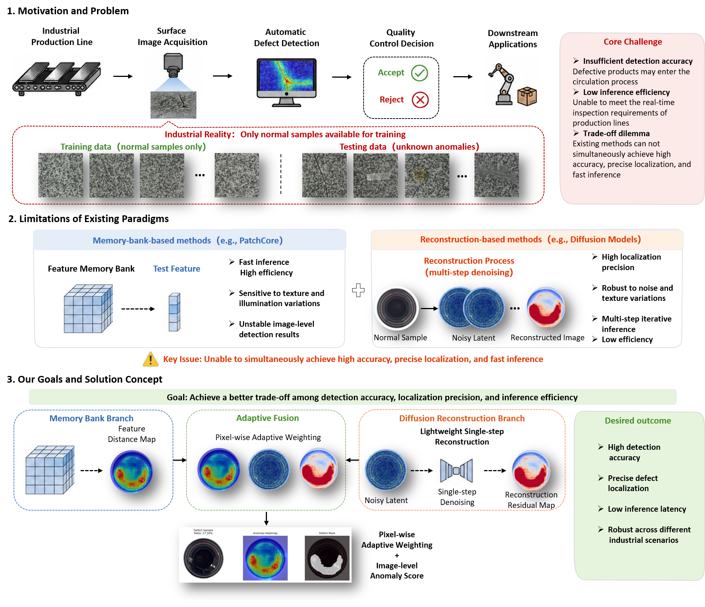
</p>
**Figure 1. Motivation of integrating memory bank and diffusion reconstruction for industrial surface defect detection.**  

In industrial production, training data often consist predominantly of normal samples, whereas unknown defects may appear during testing. Memory-bank methods provide efficient feature matching but can be sensitive to texture, illumination, and local structural variations. Reconstruction-based diffusion methods provide stronger localization responses but usually introduce higher computational overhead due to iterative denoising.

FPC-LDR is designed to exploit the complementary strengths of these two paradigms and to achieve a more practical trade-off among:

1. detection accuracy;
2. localization precision;
3. inference efficiency;
4. robustness across heterogeneous industrial products.

---

## 3. Framework 

### 3.1 Overall Architecture

<p align="center">
  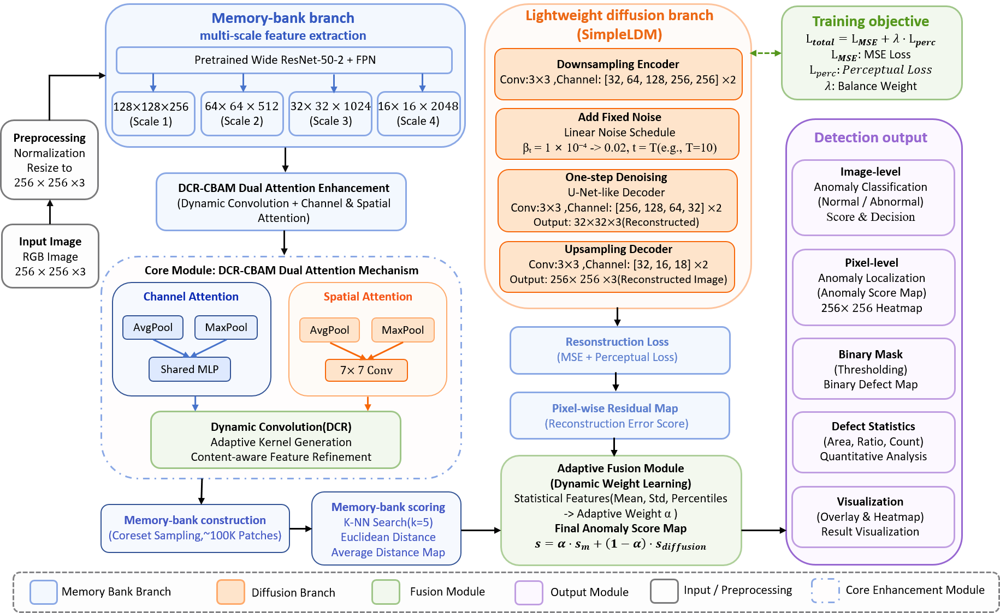
</p>
**Figure 2. Overall end-to-end architecture of FPC-LDR.**  

FPC-LDR contains two parallel anomaly-detection branches:

- **Memory-bank branch**
  - multi-scale feature extraction;
  - FPN feature representation;
  - DCR-CBAM dual-attention enhancement;
  - coreset sampling;
  - k-nearest-neighbor anomaly scoring.

- **Lightweight diffusion branch**
  - latent-space encoding;
  - controlled noise injection;
  - single-step denoising;
  - image reconstruction;
  - reconstruction-residual anomaly scoring.

The two branch outputs are normalized and fused to generate the final anomaly map, which is then used for image-level anomaly classification, pixel-level defect localization, binary-mask generation, and defect-statistics analysis.

---

### 3.2 Core Modules and Data Flow 

<p align="center">
  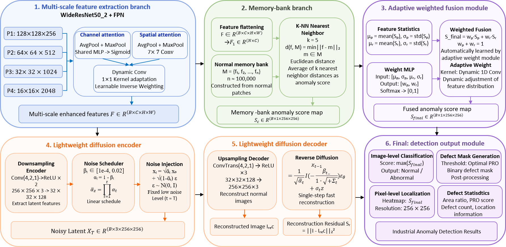
</p>
**Figure 3. Detailed implementation and data flow of the core FPC-LDR modules.**  

The reported implementation uses an ImageNet-pretrained backbone with multi-scale feature extraction. In the experimental configuration, the feature pyramid produces feature maps at:

- `128 × 128 × 256`
- `64 × 64 × 512`
- `32 × 32 × 1024`
- `16 × 16 × 2048`

The memory bank contains approximately **100,000 feature vectors**, and anomaly scoring uses **k = 5** nearest neighbors with the mean Euclidean distance.

The lightweight diffusion branch uses a compact encoder-decoder design and performs single-step reconstruction in latent space. Reconstruction errors are converted into a dense anomaly map.

## 4. Lightweight Single-Step Diffusion

<p align="center">
  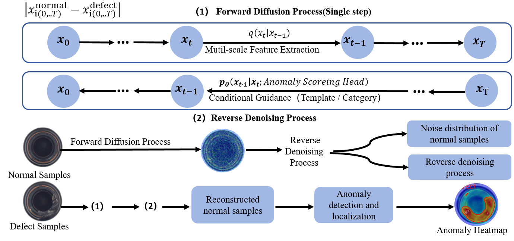
</p>
**Figure 4(a). Principle of diffusion-based reconstruction and anomaly localization.**  

Conventional diffusion models rely on iterative reverse denoising. For industrial anomaly detection, the objective is not unrestricted sample generation, but reconstruction of the **normal counterpart** of a potentially anomalous input.

FPC-LDR therefore introduces a lightweight single-step latent diffusion strategy:

1. encode the input into a latent representation;
2. inject noise at a controlled noise level;
3. estimate the clean latent representation with a single denoising-network evaluation;
4. decode the reconstructed latent representation;
5. calculate the pixel-wise reconstruction residual.

This design reduces the inference overhead associated with conventional multi-step diffusion while retaining useful defect-localization responses.

---

## 5. Training and Inference Workflow 

<p align="center">
  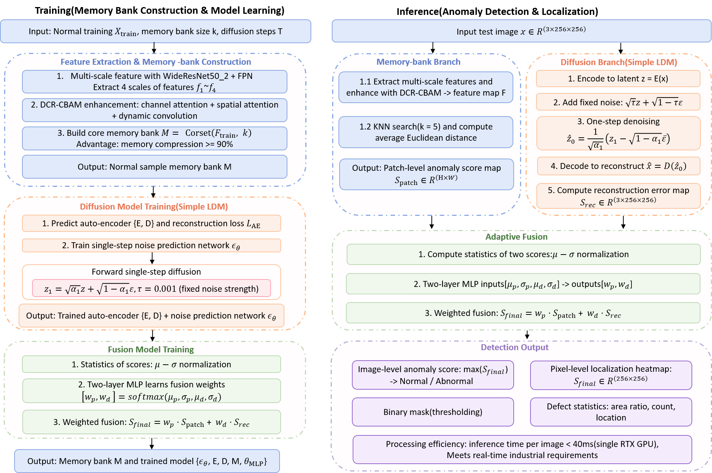
</p>
**Figure 5. Workflow of the FPC-LDR algorithm.**  

#### Training stage

Only defect-free normal images are used for model training.

**Memory-bank construction**
1. extract multi-scale features;
2. apply feature enhancement;
3. perform coreset sampling;
4. construct the normal memory bank.

**Diffusion-model optimization**
1. train the autoencoder;
2. train the noise-prediction network;
3. optimize normal-image reconstruction.

**Fusion learning**
1. obtain anomaly-score statistics from both branches;
2. estimate branch contributions;
3. generate the fused anomaly map.

#### Inference stage

Each test image is processed by both branches in parallel:

```text
Input image
   ├── Memory-bank branch ──> Feature-distance anomaly map
   └── Diffusion branch   ──> Reconstruction-residual anomaly map
                                  │
                         Adaptive fusion
                                  │
                         Final anomaly map
                         ├── Image-level score
                         ├── Pixel-level heatmap
                         ├── Binary defect mask
                         └── Defect statistics
```

---

## 6. Datasets 

### MVTec AD

MVTec AD is the primary benchmark used in this work. It contains **15 categories**, including five texture categories and ten object categories. The manuscript reports:

- **3,629** defect-free training images;
- **1,725** test images;
- **73** real-world defect types;
- pixel-level ground-truth masks for defective regions.

Texture categories:

`carpet`, `grid`, `leather`, `tile`, `wood`

Object categories:

`bottle`, `cable`, `capsule`, `hazelnut`, `metal_nut`, `pill`, `screw`, `toothbrush`, `transistor`, `zipper`

---

### VisA

VisA is used for cross-dataset generalization evaluation. It contains **12 industrial object categories** and introduces more complex backgrounds, diverse anomaly patterns, and substantial intra-class variation.

The manuscript applies the model configurations established on MVTec AD to VisA without dataset-specific hyperparameter tuning.

---

## 7. Experimental Setup 

| Item | Setting |
|---|---|
| Framework | PyTorch |
| GPU | NVIDIA V100, 32 GB |
| Input resolution | 256 × 256 |
| Pretraining | ImageNet |
| Backbone | Wide ResNet-50-2 in the reported implementation |
| Feature pyramid | 4 scales |
| Memory bank | ≈ 100,000 feature vectors |
| Nearest neighbors | k = 5 |
| Diffusion branch | SimpleLDM |
| Reconstruction | Single-step latent reconstruction |
| Training samples | Normal samples only |
| Data augmentation | No additional augmentation |

---

## 8. Quantitative Results 

### 8.1 MVTec AD Overall Results 

| Metric | FPC-LDR |
|---|---:|
| Image AUROC | **94.65%** |
| Pixel AUROC | **94.54%** |
| PRO | **95.28%** |
| Average inference latency | **26.14 ms/image** |
| Approximate throughput | **38.3 FPS** |

The results demonstrate a balanced performance among image-level discrimination, pixel-level localization, and inference efficiency. The reported latency corresponds to approximately **38.3 FPS** under the experimental hardware configuration.

---

### 8.2 Category-Wise MVTec AD Results 

| Category | Image AUROC (%) | Pixel AUROC (%) | PRO (%) | Threshold | Time (ms) |
|---|---:|---:|---:|---:|---:|
| bottle | 99.76 | 97.43 | 94.40 | 1.3531 | 27.5479 |
| cable | 98.93 | 97.15 | 92.50 | 2.0060 | 24.8237 |
| capsule | 88.55 | 96.67 | 90.45 | 1.0469 | 23.4968 |
| carpet | 96.59 | 97.83 | 98.17 | 1.4382 | 29.5039 |
| grid | 88.64 | 98.28 | 83.68 | 1.5235 | 29.3211 |
| hazelnut | 93.04 | 96.86 | 96.75 | 1.9833 | 33.0660 |
| leather | 90.52 | 99.41 | 97.72 | 1.4224 | 24.1424 |
| metal_nut | 98.48 | 89.87 | 99.21 | 1.6887 | 27.6758 |
| pill | 92.39 | 85.46 | 91.31 | 1.4285 | 27.3118 |
| screw | 99.88 | 98.39 | 99.50 | 1.2538 | 28.7417 |
| tile | 96.07 | 94.27 | 97.40 | 1.8840 | 29.2100 |
| toothbrush | 90.28 | 94.96 | 99.78 | 1.3342 | 9.7509 |
| transistor | 93.79 | 81.00 | 94.47 | 1.7745 | 21.5545 |
| wood | 99.56 | 93.94 | 94.25 | 1.6708 | 30.0200 |
| zipper | 93.30 | 96.53 | 99.56 | 1.1709 | 25.9205 |

---

## 9. Comparison with Representative Baselines

<p align="center">
  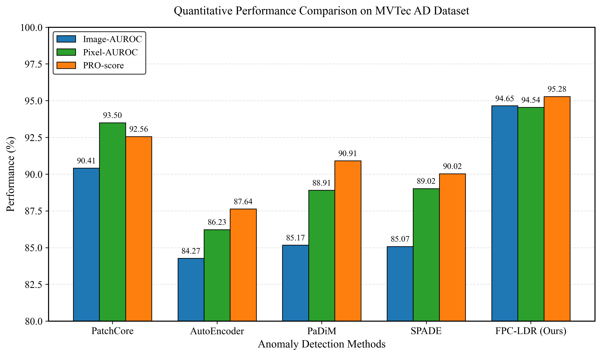
</p>
**Figure 10. Comparison of the core performance metrics of different anomaly detection methods on MVTec AD.**  

### MVTec AD

| Method | Image AUROC (%) | Pixel AUROC (%) | PRO (%) | Threshold | Time (ms) |
|---|---:|---:|---:|---:|---:|
| PatchCore | 90.41 | 93.50 | 92.56 | 4.9734 | 20.19 |
| AutoEncoder | 84.27 | 86.23 | 87.64 | 0.4221 | 7.83 |
| PaDiM | 85.17 | 88.91 | 90.91 | 0.9494 | 8.31 |
| SPADE | 85.07 | 89.02 | 90.02 | 0.9449 | 8.20 |
| **FPC-LDR** | **94.65** | **94.54** | **95.28** | **1.5319** | **26.14** |

Under the unified experimental protocol reported in the manuscript, FPC-LDR outperforms PatchCore by **4.24 percentage points in Image AUROC**, **1.04 points in Pixel AUROC**, and **2.72 points in PRO**. The results support the complementary effect of memory-based discrimination and diffusion-based reconstruction.

---

## 10. Cross-Dataset Evaluation on VisA

### VisA Results

| Method | Image AUROC (%) | Pixel AUROC (%) | PRO (%) | Threshold | Time (ms) |
|---|---:|---:|---:|---:|---:|
| PatchCore | 90.18 | 96.64 | 89.30 | 5.0788 | 43.63 |
| AutoEncoder | 86.40 | 88.61 | 92.11 | 0.4185 | 13.68 |
| PaDiM | 91.07 | 93.31 | 85.41 | 4.7300 | 64.80 |
| SPADE | 93.04 | 89.30 | 94.50 | 0.1143 | 16.55 |
| **FPC-LDR** | **95.16** | **93.99** | **91.57** | **0.9487** | **69.00** |

FPC-LDR achieves an Image AUROC of **95.16%**, ranking first among the compared methods in the reported experiment. The memory-bank branch provides transferable semantic references, while diffusion residuals provide complementary distributional evidence.

---

## 11. Qualitative Results

### 11.1 3D Anomaly Heatmaps 

<p align="center">
  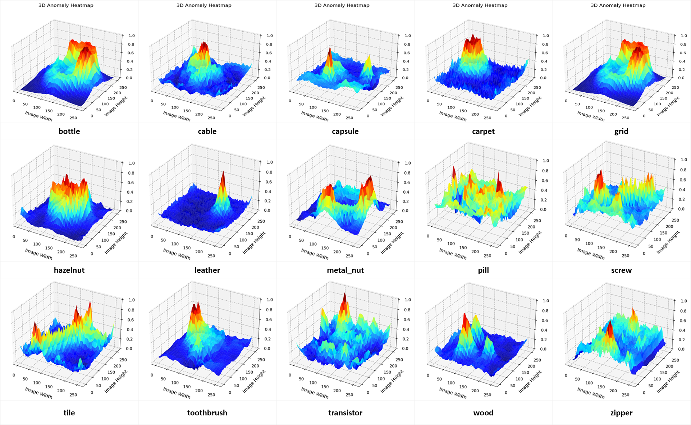
</p>
**Figure 4(b). 3D anomaly heatmaps for the 15 MVTec AD categories.**  

High-score peaks correspond to defect regions and provide an intuitive view of the spatial anomaly responses.  

---

### 11.2 Confusion Matrices

<p align="center">
  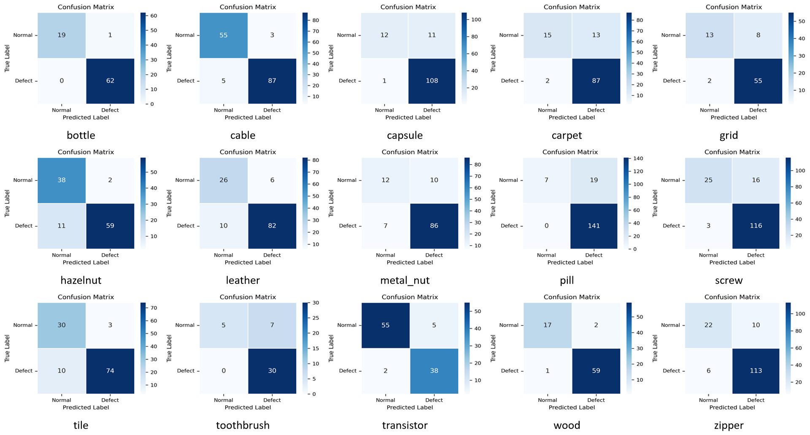
</p>
**Figure 6. Confusion matrices for different product defect types.**  

---

### 11.3 Diffusion Reconstruction Responses 

<p align="center">
  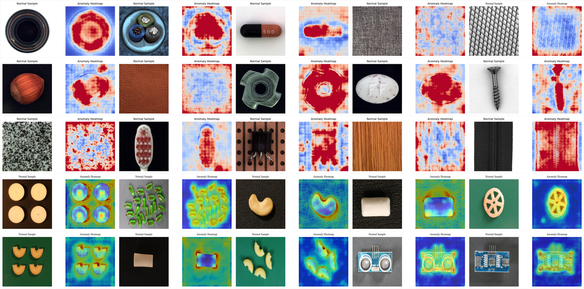
</p>
**Figure 7. Diffusion-based reconstruction of normal samples.**  

---

### 11.4 Pixel-Level Localization on MVTec AD 

<p align="center">
  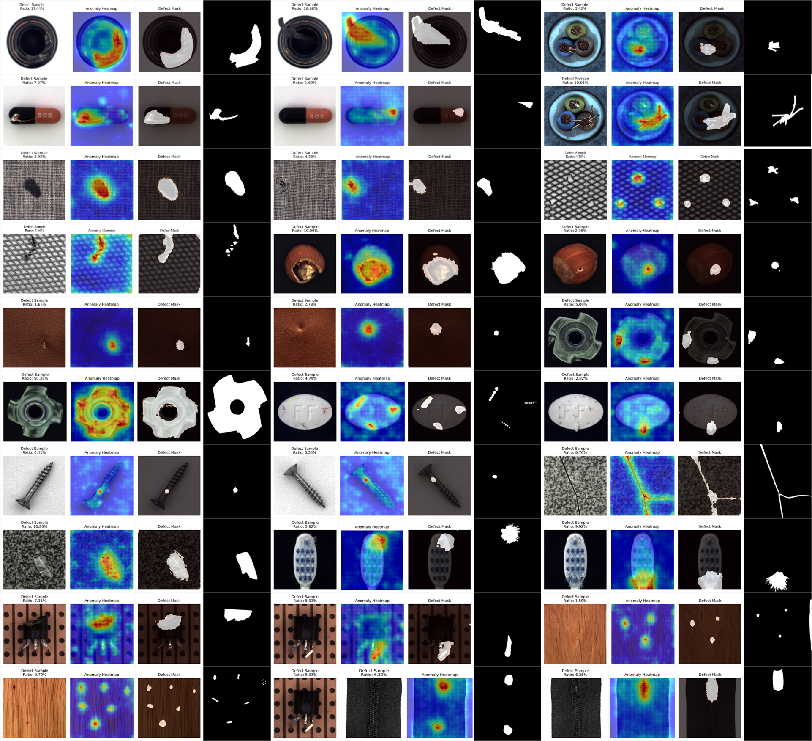
</p>
**Figure 8. Qualitative defect-localization results of FPC-LDR on MVTec AD.**  

The visualization includes defective inputs, anomaly heatmaps, predicted masks, and ground-truth masks. The reported examples cover small-scale defects, larger anomalous regions, texture anomalies, and structural defects.

---

### 11.5 Anomaly-Score Distribution 

<p align="center">
  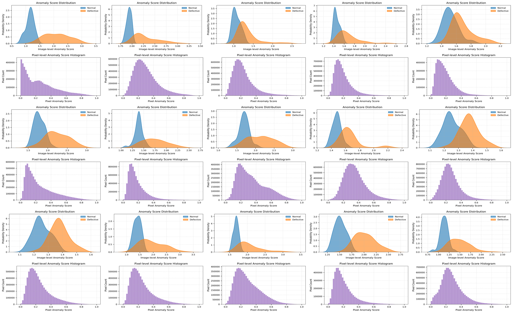
</p>
**Figure 9. Visualization of anomaly-score distributions produced by FPC-LDR.**  

Normal samples are mainly concentrated in lower-score regions, whereas anomalous samples tend to shift toward higher scores. 

---

### 11.6 Localization on VisA 

<p align="center">
  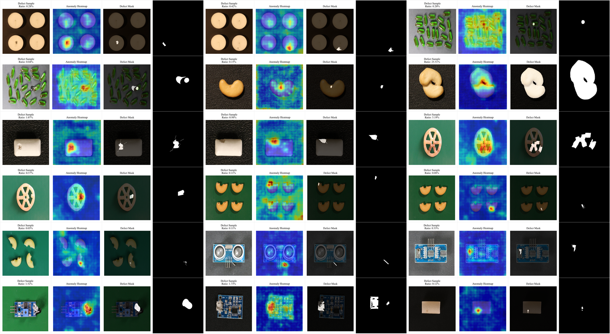
</p>
**Figure 11. Defect localization results of FPC-LDR on VisA.**  

---

## 12. Ablation Studies 

### 12.1 Core Functional Modules

| Config. | Memory | Diffusion | Adaptive Fusion | Score Optimization | Image AUROC (%) | Pixel AUROC (%) | PRO (%) | Time (ms) |
|---|---:|---:|---|---:|---:|---:|---:|---:|
| A | ✓ | — | — | — | 94.49 | 95.52 | 93.33 | 37.68 |
| B | — | ✓ | — | — | 96.08 | 95.40 | 95.06 | 75.78 |
| C | ✓ | ✓ | Fixed | — | 97.00 | 94.98 | 94.28 | 36.34 |
| D | ✓ | ✓ | Adaptive | — | **97.76** | **95.55** | **95.68** | 34.93 |
| E | ✓ | ✓ | Adaptive | ✓ | 97.95 | 95.55 | 95.68 | 34.93 |

The progressive ablation study demonstrates the complementary roles of the major modules:

- the memory branch provides efficient local anomaly discrimination;
- the diffusion branch improves regional anomaly modeling but is computationally more expensive when used alone;
- combining both branches confirms the complementarity of discriminative feature matching and generative reconstruction;
- adaptive fusion improves the integration of heterogeneous anomaly responses;
- the final configuration emphasizes a practical balance among detection performance, localization capability, and processing efficiency for continuous manufacturing inspection.

---

### 12.2 Key Model Configurations

#### Feature Extractor 

| Backbone | Image AUROC (%) | Pixel AUROC (%) | PRO (%) | Time (ms) |
|---|---:|---:|---:|---:|
| ResNet18 | 87.47 | 90.14 | 94.29 | 68.59 |
| ResNet34 | 88.44 | 92.33 | 97.65 | 31.61 |
| **ResNet50** | **94.65** | **94.54** | 95.28 | **26.14** |
| MobileNetV2 | 85.70 | 89.30 | 93.60 | 38.07 |
| ConvNet | 91.85 | 91.33 | 92.46 | 90.20 |

#### Diffusion Noise Schedule

| Schedule | Image AUROC (%) | Pixel AUROC (%) | PRO (%) | Time (ms) |
|---|---:|---:|---:|---:|
| **Linear β** | **94.65** | **94.54** | 95.28 | 26.14 |
| Cosine β | 87.41 | 92.01 | 96.66 | 27.99 |
| Quadratic β | 89.89 | 91.13 | 93.93 | 51.80 |
| Constant β | 87.42 | 91.99 | 96.67 | 24.89 |

#### Reconstruction Strategy 

| Strategy | Image AUROC (%) | Pixel AUROC (%) | PRO (%) | Time (ms) |
|---|---:|---:|---:|---:|
| Direct Reconstruction | 86.05 | 91.74 | 90.38 | 23.22 |
| **Diffusion Reconstruction** | **94.65** | **94.54** | **95.28** | 26.14 |
| Multi-scale Reconstruction | 85.96 | 88.61 | 95.19 | 22.97 |

#### Loss Function 

| Loss | Image AUROC (%) | Pixel AUROC (%) | PRO (%) | Time (ms) |
|---|---:|---:|---:|---:|
| MSE | 87.41 | 91.98 | 96.67 | 21.80 |
| L1 Loss | 87.42 | 91.98 | 96.65 | 26.00 |
| Perceptual Loss | 87.42 | 91.99 | 96.66 | 24.35 |
| **MSE + Perceptual** | **94.65** | **94.54** | 95.28 | 26.14 |

The ablation results show that the final configuration is selected based on a balanced consideration of anomaly discrimination, localization performance, and inference efficiency rather than a single metric.

---

## 13. Evaluation Metrics 

The manuscript reports the following metrics:  

- **Image AUROC** — image-level normal/anomalous discrimination  
  
- **Pixel AUROC** — pixel-wise defect localization performance  
  
- **PRO** — per-region overlap for defect-region localization  
  
- **Decision threshold** — threshold used for binary defect decision / mask generation  
  
- **Inference time** — end-to-end inference latency per image  

---

## 14. Repository Structure 

```text
FPC-LDR/
├── README.md
├── LICENSE
├── requirements.txt
├── configs/
│   ├── mvtec.yaml
│   └── visa.yaml
├── datasets/
│   └── README.md
├── fpc_ldr/
│   ├── backbones/
│   ├── memory_bank/
│   ├── diffusion/
│   ├── fusion/
│   ├── metrics/
│   └── utils/
├── scripts/
│   ├── train.py
│   ├── test.py
│   ├── evaluate.py
│   └── visualize.py
├── checkpoints/
├── outputs/
│   ├── metrics/
│   ├── heatmaps/
│   └── masks/
└── assets/
    └── figures/
```

---

## 15. Installation

```bash
cd FPC-LDR

conda create -n fpc-ldr python=<PYTHON_VERSION>
conda activate fpc-ldr

pip install -r requirements.txt
```

---

## 16. Dataset Preparation

Please download the datasets from the official MVTec AD and VisA websites, or use the datasets provided in this repository. The MVTecAD dataset has its original structure, while the VisA dataset has been reorganized to match the structure of the MVTecAD dataset. The masks in the original VisA dataset are not in the 0-255 range, with masks being completely black. Run mask_transfer.py or the following code to normalize the range.

import os

import cv2

import numpy as np

\# ======================  ======================

original_mask_dir = r""

output_mask_dir = r""

\# =================================================================

def convert_visa_masks():

  os.makedirs(output_mask_dir, exist_ok=True)

  img_suffix = ('.png', '.jpg', '.jpeg', '.bmp')

  mask_files = [f for f in os.listdir(original_mask_dir) if f.lower().endswith(img_suffix)]

  if len(mask_files) == 0:

​    print("Not found mask!！")

​    return

  print(f"total_mask: {len(mask_files)}，processing...\n")

  for idx, mask_name in enumerate(mask_files):

​    mask_path = os.path.join(original_mask_dir, mask_name)

​    mask = cv2.imread(mask_path, cv2.IMREAD_GRAYSCALE)

​    if mask is None:

​      print(f"skkip not found ：{mask_name}")

​      continue

​    _, binary_mask = cv2.threshold(mask, 0, 255, cv2.THRESH_BINARY)

​    save_path = os.path.join(output_mask_dir, mask_name)

​    cv2.imwrite(save_path, binary_mask)

​    if (idx + 1) % 20 == 0 or idx + 1 == len(mask_files):

​      print(f"processed：{idx+1}/{len(mask_files)}")

  print(f"\nfinished,saved to：{output_mask_dir}")

if __name__ == "__main__":

  convert_visa_masks()

 

```text
datasets/
├── mvtec_ad/
│   ├── bottle/
│   ├── cable/
│   ├── capsule/
│   └── ...
└── visa/
    └── ...
```

---

## 17. Training 

```bash
python train.py --config configs/mvtec.yaml
```

For a single MVTec AD category 

```bash
python scripts/train.py \
    --config configs/mvtec.yaml \
    --category bottle
```

---

## 18. Evaluation

```bash
python test.py --config configs/mvtec.yaml
```

VisA:

```bash
python scripts/test.py --config configs/visa.yaml
```

 outputs 

```text
outputs/
├── metrics/
│   ├── category_results.csv
│   └── overall_results.csv
├── heatmaps/
├── masks/
└── visualizations/
```

---

## 22. Limitations and Future Work 

The manuscript identifies two main limitations:

1. FPC-LDR is still slower than some lightweight anomaly-detection methods, which may limit deployment on highly resource-constrained edge devices.
2. Localization performance for extremely small and low-contrast defects can be further improved.

Future work will focus on:

- model quantization and pruning for embedded deployment;
- improved multi-scale feature enhancement for subtle defects;
- incremental learning for dynamic shifts in the distribution of normal production data.
